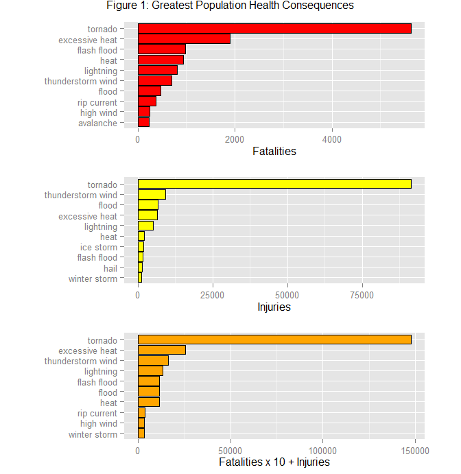
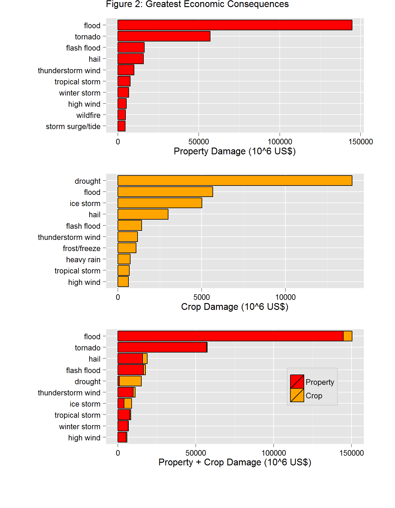

# Impacts of weather related events: A case study of the USA
Mario Azevedo  
Sunday, May 24, 2015  

###Synopsis
Some weather related events can cause serious disruption of peoples life. Men may be blamed for provocating some of these "nature's revenge" episodies. This study was prepared based on a huge database of these type of events that have affect the US territory. The data set was gathered by the U.S. National Oceanic and Atmospheric Administration's (NOAA) and, in this case,  it was used a copy available at https://d396qusza40orc.cloudfront.net/repdata%2Fdata%2FStormData.csv.bz2. The main objectives were the evaluation of the most harmful type of events with respect to population health and those with higher impact on the economy. After the analysis it was possible to list the type of events with more significant impacts.

###Preparing the analysis environment

The first step consists of loading the libraries that will be used in the R script. SOme of them will be used to clean and shape the data sets (data.table, dplyr and tidyr). Other will be used to deal with graph preparation (ggplot2, grid, gridExtra). "stringr" will be used to manipulate some strings and "RCurl" is necessary for file downloading.


```r
require(data.table)
require(dplyr)
require(tidyr)
require(ggplot2)
require(stringr)
require(grid)
require(gridExtra)
require(RCurl)
```

###Data Processing

####Downloading and reading the data

The idea here is to download the file and save it at the local disk. In a second step the data is read. There is a second file (storm.txt), locally produced, consisting of a list of the events types.


```r
fileURL <- "https://d396qusza40orc.cloudfront.net/repdata%2Fdata%2FStormData.csv.bz2"
localfilename <- "repdata-data-StormData.csv.bz2"
download.file(fileURL,localfilename,method="curl")
data <- read.csv(localfilename)
#Reading a data file prepared from the "Storm Data Event Table"
type <- readLines('storm.txt')
data <- data.table(data)
nr1 <- nrow(data)
options(scipen=1, digits=2)
```

####Cleaning the data

The databse contains 902297 records. After some quick inspection it was noticed some small problems, mainly mispelled words, in the columns that will be used for this study. The column that stores the events types (EVTYPE) has 985, but only 48 were expected.

The cleaning process consisted of fixing some mispelled words and filtering, in order to keep just the events present in the official list. The changes were:  

* Convert all values of EVTYPE to uppercase;  
* Replace "TSTM" with "THUNDERSTORM";  
* Replace "WINDS" with "WIND".  


```r
data <- mutate(data,EVTYPE = str_to_upper(str_trim(EVTYPE)))
data[data$EVTYPE == "TSTM WIND"]$EVTYPE <- "THUNDERSTORM WIND"
data[data$EVTYPE == "THUNDERSTORM WINDS"]$EVTYPE <- "THUNDERSTORM WIND"
data[data$EVTYPE == "MARINE TSTM WIND"]$EVTYPE <- "MARINE THUNDERSTORM WIND"
data[data$EVTYPE == "MARINE THUNDERSTORM WINDS"]$EVTYPE <- "MARINE THUNDERSTORM WIND"
data <- filter(data,EVTYPE %in% type)
nr2 <- nrow(data)
perc1 <- 100*nr2/nr1
```

That manipulation resulted in a slightily smaller set of data, with 882319 records (97.7858732% of the original set). For dealing with the first objective (harmful events) two other colums (FATALITIES and INJURIES) are necessary but there were no problems with this data. 

For the second objective it was necessary to take a look at four columns despicting economic damage affecting properties and crops:

* PROPDMG - the estimated cost of the event damage caused to properties;  
* PROPDMGEXP - a factor representing a multiplier for the above column (K for thousand, M for million and B for billion dollars);  
* CROPDMG - the estimated cost of the event damage caused to crops;  
* CROPDMGEXP - a multiplier, similar to the above.  

Only the multiplier columns presented some typos or factors not in the c('K','M','B','') list. That was solved with some mutation and filtering.  


```r
data <- mutate(data,PROPDMGEXP = str_to_upper(str_trim(PROPDMGEXP))) %>% 
        filter(PROPDMGEXP %in% c('K','M','B','')) 
data <- mutate(data,CROPDMGEXP = str_to_upper(str_trim(CROPDMGEXP))) %>% 
        filter(CROPDMGEXP %in% c('K','M','B',''))
nr3 <- nrow(data)
perc2 <- 100*nr3/nr1
```

After this process, there were 881992 rows (97.7496323% of the original set). 

###Data Analyses

In order to achieve the proposed objectives, some data manipulation and the production of some indicators are necessary. This section describes this process.

####Fatalities and Injuries


```r
totFat <- sum(data$FATALITIES,na.rm=TRUE)
totInj <- sum(data$INJURIES,na.rm=TRUE)
harm <- group_by(data,EVTYPE) %>% 
        summarise(NofEV=n(),Fatalities = sum(FATALITIES),
                  Injuries=sum(INJURIES),
                  sevIndex = (10*sum(FATALITIES)+sum(INJURIES))) 
len <- nrow(harm)
harm$rankF <- len - ave(harm$Fatalities,FUN=rank) + 1
harm$rankI <- len - ave(harm$Injuries,FUN=rank) + 1
harm$rankS <- len - ave(harm$sevIndex,FUN=rank) + 1
```

####Properties and Crop Damage


```r
any <- data[PROPDMGEXP == 'K',PROPDMG:=PROPDMG/1000]
any <- data[PROPDMGEXP == 'B',PROPDMG:=PROPDMG*1000]
any <- data[CROPDMGEXP == 'K',CROPDMG:=CROPDMG/1000]
any <- data[CROPDMGEXP == 'B',CROPDMG:=CROPDMG*1000]
totPdmg <- sum(data$PROPDMG,na.rm=TRUE)
totCdmg <- sum(data$CROPDMG,na.rm=TRUE)
econ <- group_by(data,EVTYPE) %>% 
        summarise(NofEV=n(),
                  PropDmg = sum(PROPDMG),
                  CropDmg=sum(CROPDMG),
                  TotDmg = sum(PROPDMG)+sum(CROPDMG)) %>%
        arrange(desc(PropDmg))
len <- nrow(econ)
econ$rankP <- len - ave(econ$PropDmg,FUN=rank) + 1
econ$rankC <- len - ave(econ$CropDmg,FUN=rank) + 1
econ$rankT <- len - ave(econ$TotDmg,FUN=rank) + 1
```

###Results
* There should be a section titled Results in which your results are presented.  
* You may have other sections in your analysis, but Data Processing and Results are required.  
* The analysis document must have at least one figure containing a plot.  
* Your analyis must have no more than three figures. Figures may have multiple plots in them (i.e. panel plots), but there cannot be more than three figures total.  
* You must show all your code for the work in your analysis document. This may make the document a bit verbose, but that is okay. In general, you should ensure that echo = TRUE for every code chunk (this is the default setting in knitr).  


####Fatalities and Injuries

```r
result1 <- arrange(harm,rankF)[1:10] %>% 
        mutate(EVTYPE = str_to_lower(EVTYPE))
ord1 <- reorder(result1$EVTYPE,result1$Fatalities)
p1 <- ggplot(result1,aes(x=ord1,y=Fatalities)) + 
        geom_bar(stat="identity",position="dodge",fill="red",color="black") + 
        xlab("") + ylab("Fatalities") + coord_flip()

result2 <- arrange(harm,rankI)[1:10] %>% 
        mutate(EVTYPE = str_to_lower(EVTYPE))
ord2 <- reorder(result2$EVTYPE,result2$Injuries)
p2 <- ggplot(result2,aes(x=ord2,y=Injuries)) + 
        geom_bar(stat="identity",position="dodge",fill="yellow",color="black") + 
        xlab("") + ylab("Injuries") + coord_flip()

result3 <- arrange(harm,rankS)[1:10] %>% 
        mutate(EVTYPE = str_to_lower(EVTYPE))
ord3 <- reorder(result3$EVTYPE,result3$sevIndex)
p3 <- ggplot(result3,aes(x=ord3,y=sevIndex)) + 
        geom_bar(stat="identity",position="dodge",fill="orange",color="black") + 
        xlab("") + ylab("Fatalities x 10 + Injuries") + coord_flip()

grid.arrange(p1, p2, p3, ncol = 1, 
             main = "Figure 1: Greatest Population Health Consequences",
             widths = unit(c(16), "cm"),
             heights = unit(c(7,7,7), "cm"),
             just=c("top"))
```

 

####Properties and Crop Damage

```r
result1 <- arrange(econ,rankP)[1:10] %>% 
        mutate(EVTYPE = str_to_lower(EVTYPE))
ord1 <- reorder(result1$EVTYPE,result1$PropDmg)
p1 <- ggplot(result1,aes(x=ord1,y=PropDmg)) + 
        geom_bar(stat="identity",position="dodge",fill="red",color="black") + 
        xlab("") + ylab("Property Damage (10^6 US$)") + coord_flip()

result2 <- arrange(econ,rankC)[1:10] %>% 
        mutate(EVTYPE = str_to_lower(EVTYPE))
ord2 <- reorder(result2$EVTYPE,result2$CropDmg)
p2 <- ggplot(result2,aes(x=ord2,y=CropDmg)) + 
        geom_bar(stat="identity",position="dodge",fill="yellow",color="black") + 
        xlab("") + ylab("Crop Damage (10^6 US$)") + coord_flip()

result3 <- arrange(econ,rankT)[1:10] %>% 
        mutate(EVTYPE = str_to_lower(EVTYPE)) %>% 
        gather(type,value,c(PropDmg,CropDmg))
ord3 <- reorder(result3$EVTYPE,result3$TotDmg)
cols <- c(PropDmg="red",CropDmg="yellow")
p3 <- ggplot(result3,aes(x=ord3,y=value,fill=type)) + 
        geom_bar(stat="identity",barposition="stack",color="black") + 
        xlab("") + ylab("Property + Crop Damage (10^6 US$)") + coord_flip() +
        scale_fill_manual(values=cols,labels=c("Property","Crop")) +
        theme(legend.position=c(.8,.5),
              legend.title=element_blank(),
              legend.background = element_rect(color = "grey80", 
                                               fill = "grey90", 
                                               size = .5, 
                                               linetype = "solid"))

grid.arrange(p1, p2, p3, ncol = 1, 
             main = "Figure 2: Greatest Economic Consequences",
             widths = unit(c(16), "cm"),
             heights = unit(c(7,7,7), "cm"),
             just = c("top"))
```

 

###Conclusion

###References (?)


