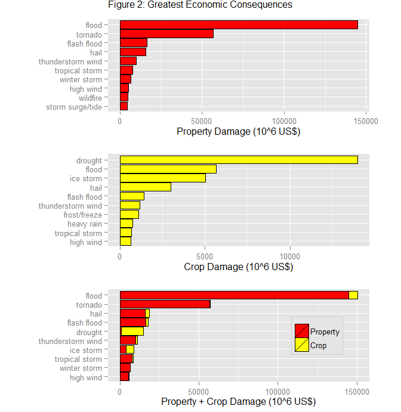

# Impacts of weather related events: A case study of the USA
Mario A. N. Azevedo Filho  
Sunday, May 24, 2015  

###Synopsis
Some weather related events can cause serious disruption of people's life. Men may be blamed for causing some of these "nature's revenge" episodes. This study was prepared based on a huge database of these types of events that have affected the US territory. The data set was gathered by the U.S. [National Oceanic and Atmospheric Administration's (NOAA)](http://www.noaa.gov/) and, in this case,  it was used a copy available [here](https://d396qusza40orc.cloudfront.net/repdata%2Fdata%2FStormData.csv.bz2). The main objectives were the evaluation of the most harmful type of events with respect to population health and those with higher impact on the economy. After the analysis it was possible to list the type of events with more significant impacts.

###Preparing the analysis environment

The first step consists of loading the libraries that will be used in the R script. Some of them will be used to clean and shape the data sets (data.table, dplyr and tidyr). Other will be used to deal with graph preparation (ggplot2, grid, gridExtra). "stringr" will be used to manipulate some strings and "RCurl" is necessary for file downloading.


```r
require(data.table)
require(dplyr)
require(tidyr)
require(ggplot2)
require(stringr)
require(grid)
require(gridExtra)
require(RCurl)
options(scipen=1, digits=2,width=100)
```

###Data Processing

####Downloading and reading the data

The idea here is to download the file and save it at the local disk. In a second step the data is read. There is a second file ([storm.txt](https://github.com/manazevedof/RepData_PeerAssessment2/blob/master/storm.txt "storm.txt")), locally produced, consisting of a list of the events types.


```r
fileURL <- "https://d396qusza40orc.cloudfront.net/repdata%2Fdata%2FStormData.csv.bz2"
localfilename <- "repdata-data-StormData.csv.bz2"
download.file(fileURL,localfilename,method="curl")
data <- read.csv(localfilename)
#Reading a data file prepared from the "Storm Data Event Table"
type <- readLines('storm.txt')
data <- data.table(data)
nr1 <- nrow(data)
```

####Cleaning the data set

The database contains 902297 records. After some quick inspection it was noticed some small problems, mainly misspelled words, in the columns that will be used for this study. The column that stores the events types (EVTYPE) has 985, but only 48 were expected.

The cleaning process consisted of fixing some misspelled words and filtering, in order to keep just the events present in the official list. The changes were:  

* Convert all values of EVTYPE to uppercase;  
* Replace "TSTM" with "THUNDERSTORM";  
* Replace "WINDS" with "WIND".  


```r
data <- mutate(data,EVTYPE = str_to_upper(str_trim(EVTYPE)))
data[data$EVTYPE == "TSTM WIND"]$EVTYPE <- "THUNDERSTORM WIND"
data[data$EVTYPE == "THUNDERSTORM WINDS"]$EVTYPE <- "THUNDERSTORM WIND"
data[data$EVTYPE == "MARINE TSTM WIND"]$EVTYPE <- "MARINE THUNDERSTORM WIND"
data[data$EVTYPE == "MARINE THUNDERSTORM WINDS"]$EVTYPE <- "MARINE THUNDERSTORM WIND"
data <- filter(data,EVTYPE %in% type)
nr2 <- nrow(data)
perc1 <- 100*nr2/nr1
```

That manipulation resulted in a slightly smaller set of data, with (97.79% of the original set). For dealing with the first objective (harmful events) two other columns (FATALITIES and INJURIES) are necessary but there were no problems with this data.  

For the second objective it was necessary to take a look at four columns depicting economic damage affecting properties and crops:

* PROPDMG - the estimated cost of the event damage caused to properties;  
* PROPDMGEXP - a factor representing a multiplier for the above column (K for thousand, M for million and B for billion dollars);  
* CROPDMG - the estimated cost of the event damage caused to crops;  
* CROPDMGEXP - a multiplier, similar to the above.  

Only the multiplier columns presented some typos or factors not in the c('K','M','B','') list. That was solved with some mutation and filtering.


```r
data <- mutate(data,PROPDMGEXP = str_to_upper(str_trim(PROPDMGEXP))) %>% 
        filter(PROPDMGEXP %in% c('K','M','B','')) 
data <- mutate(data,CROPDMGEXP = str_to_upper(str_trim(CROPDMGEXP))) %>% 
        filter(CROPDMGEXP %in% c('K','M','B',''))
nr3 <- nrow(data)
perc2 <- 100*nr3/nr1
```

After this process, there were 881992 rows (97.75% of the original set). 

###Data Analyses

To achieve the proposed objectives, some data manipulation is necessary in order to produce the indicators. This section describes the process.

####Fatalities and Injuries

The records were grouped by event type, counting the number of fatalities and injured people for each one. A third indicator was created aggregating fatalities and injuries. Weights were used for that aggregation, 10 for fatalities and 1 for injuries. The result was named sevInd (severity indicator). This kind of weights is used in the analysis of accidents in a transportation network. Three ranking lists were prepared based on these indicators. 


```r
totFat <- sum(data$FATALITIES,na.rm=TRUE)
totInj <- sum(data$INJURIES,na.rm=TRUE)
harm <- group_by(data,EVTYPE) %>% 
        summarise(NofEV=n(),
                  Fatalities = sum(FATALITIES),
                  Injuries = sum(INJURIES),
                  sevInd = (10*sum(FATALITIES)+sum(INJURIES))) %>%
        arrange(desc(Fatalities))
len <- nrow(harm)
harm$rankF <- len - ave(harm$Fatalities,FUN=rank) + 1
harm$rankI <- len - ave(harm$Injuries,FUN=rank) + 1
harm$rankS <- len - ave(harm$sevInd,FUN=rank) + 1
harm
```

```
## Source: local data table [46 x 8]
## 
##               EVTYPE  NofEV Fatalities Injuries sevInd rankF rankI rankS
## 1            TORNADO  60628       5630    91321 147621     1     1     1
## 2     EXCESSIVE HEAT   1678       1903     6525  25555     2     4     2
## 3        FLASH FLOOD  54262        978     1777  11557     3     8     5
## 4               HEAT    767        937     2100  11470     4     6     7
## 5          LIGHTNING  15733        816     5230  13390     5     5     4
## 6  THUNDERSTORM WIND 323133        701     9352  16362     6     2     3
## 7              FLOOD  25326        470     6789  11489     7     3     6
## 8        RIP CURRENT    470        368      232   3912     8    21     8
## 9          HIGH WIND  20212        246     1137   3597     9    11     9
## 10         AVALANCHE    386        224      170   2410    10    22    12
## ..               ...    ...        ...      ...    ...   ...   ...   ...
```

####Properties and Crop Damage

The records present values in thousands, millions and billions of dollars. In this case, the first step consisted of bringing all the costs to a same base, millions of dollars. In a similar way as the one described above, three indicators were created. The first two consisted of the costs aggregation for each type of event and damage. The third one sums the two costs. In this case it was not necessary a use of any kind of weight.  


```r
any <- data[PROPDMGEXP == 'K',PROPDMG:=PROPDMG/1000]
any <- data[PROPDMGEXP == 'B',PROPDMG:=PROPDMG*1000]
any <- data[CROPDMGEXP == 'K',CROPDMG:=CROPDMG/1000]
any <- data[CROPDMGEXP == 'B',CROPDMG:=CROPDMG*1000]
totPdmg <- sum(data$PROPDMG,na.rm=TRUE)
totCdmg <- sum(data$CROPDMG,na.rm=TRUE)
econ <- group_by(data,EVTYPE) %>% 
        summarise(NofEV=n(),
                  PropDmg = sum(PROPDMG),
                  CropDmg=sum(CROPDMG),
                  TotDmg = sum(PROPDMG)+sum(CROPDMG)) %>%
        arrange(desc(PropDmg))
len <- nrow(econ)
econ$rankP <- len - ave(econ$PropDmg,FUN=rank) + 1
econ$rankC <- len - ave(econ$CropDmg,FUN=rank) + 1
econ$rankT <- len - ave(econ$TotDmg,FUN=rank) + 1
econ
```

```
## Source: local data table [46 x 8]
## 
##               EVTYPE  NofEV PropDmg CropDmg TotDmg rankP rankC rankT
## 1              FLOOD  25326  144665 5661.97 150327     1     2     1
## 2            TORNADO  60628   56940  364.95  57305     2    13     2
## 3        FLASH FLOOD  54262   16348 1420.73  17769     3     5     4
## 4               HAIL 288625   15789 3003.95  18793     4     4     3
## 5  THUNDERSTORM WIND 323133    9915 1167.50  11083     5     6     6
## 6     TROPICAL STORM    690    7704  678.35   8382     6     9     8
## 7       WINTER STORM  11432    6688   26.94   6715     7    18     9
## 8          HIGH WIND  20212    5270  638.57   5909     8    10    10
## 9           WILDFIRE   2761    4765  295.47   5061     9    14    11
## 10  STORM SURGE/TIDE    148    4641    0.85   4642    10    22    12
## ..               ...    ...     ...     ...    ...   ...   ...   ...
```

###Results

This section presents the results obtained in the process described in the previous section.

####Fatalities and Injuries

Figure 1 represents, in three graphs, the harm indicators. The Y-axis values labels depict the ranking order for each one.


```r
result1 <- arrange(harm,rankF)[1:10] %>% 
        mutate(EVTYPE = str_to_lower(EVTYPE))
ord1 <- reorder(result1$EVTYPE,result1$Fatalities)
p1 <- ggplot(result1,aes(x=ord1,y=Fatalities)) + 
        geom_bar(stat="identity",position="dodge",fill="red",color="black") + 
        xlab("") + ylab("Fatalities") + coord_flip()

result2 <- arrange(harm,rankI)[1:10] %>% 
        mutate(EVTYPE = str_to_lower(EVTYPE))
ord2 <- reorder(result2$EVTYPE,result2$Injuries)
p2 <- ggplot(result2,aes(x=ord2,y=Injuries)) + 
        geom_bar(stat="identity",position="dodge",fill="yellow",color="black") + 
        xlab("") + ylab("Injuries") + coord_flip()

result3 <- arrange(harm,rankS)[1:10] %>% 
        mutate(EVTYPE = str_to_lower(EVTYPE))
ord3 <- reorder(result3$EVTYPE,result3$sevInd)
p3 <- ggplot(result3,aes(x=ord3,y=sevInd)) + 
        geom_bar(stat="identity",position="dodge",fill="orange",color="black") + 
        xlab("") + ylab("Fatalities x 10 + Injuries") + coord_flip()

grid.arrange(p1, p2, p3, ncol = 1, 
             main = "Figure 1: Greatest Population Health Consequences",
             widths = unit(c(16), "cm"),
             heights = unit(c(6,6,6), "cm"),
             just=c("top"))
```

 

The percentage of the top-ten events for each indicator are:

* Fatalities: 90.06%
* Injuries: 94.96%
* sevInd: 91.7%

####Properties and Crop Damage

Figure 2 represents, in three graphs, the economic damage indicators. The Y-axis values labels depict the ranking order for each one.


```r
result1 <- arrange(econ,rankP)[1:10] %>% 
        mutate(EVTYPE = str_to_lower(EVTYPE))
ord1 <- reorder(result1$EVTYPE,result1$PropDmg)
p1 <- ggplot(result1,aes(x=ord1,y=PropDmg)) + 
        geom_bar(stat="identity",position="dodge",fill="red",color="black") + 
        xlab("") + ylab("Property Damage (10^6 US$)") + coord_flip()

result2 <- arrange(econ,rankC)[1:10] %>% 
        mutate(EVTYPE = str_to_lower(EVTYPE))
ord2 <- reorder(result2$EVTYPE,result2$CropDmg)
p2 <- ggplot(result2,aes(x=ord2,y=CropDmg)) + 
        geom_bar(stat="identity",position="dodge",fill="yellow",color="black") + 
        xlab("") + ylab("Crop Damage (10^6 US$)") + coord_flip()

result3 <- arrange(econ,rankT)[1:10] %>% 
        mutate(EVTYPE = str_to_lower(EVTYPE)) %>% 
        gather(type,value,c(PropDmg,CropDmg))
ord3 <- reorder(result3$EVTYPE,result3$TotDmg)
cols <- c(PropDmg="red",CropDmg="yellow")
p3 <- ggplot(result3,aes(x=ord3,y=value,fill=type)) + 
        geom_bar(stat="identity",barposition="stack",color="black") + 
        xlab("") + ylab("Property + Crop Damage (10^6 US$)") + coord_flip() +
        scale_fill_manual(values=cols,labels=c("Property","Crop")) +
        theme(legend.position=c(.8,.5),
              legend.title=element_blank(),
              legend.background = element_rect(color = "grey80", 
                                               fill = "grey90", 
                                               size = .5, 
                                               linetype = "solid"))

grid.arrange(p1, p2, p3, ncol = 1, 
             main = "Figure 2: Greatest Economic Consequences",
             widths = unit(c(16), "cm"),
             heights = unit(c(6,6,6), "cm"),
             just = c("top"))
```

 

The percentage of the top-ten events for each indicator are:

* Property damage: 96.8%
* Crop damage: 94.55%
* Total damage: 94.7%

  
  
You can access the data sets and the script on my [GitHub page: https://github.com/manazevedof/RepData_PeerAssessment2/](https://github.com/manazevedof/RepData_PeerAssessment2/).
